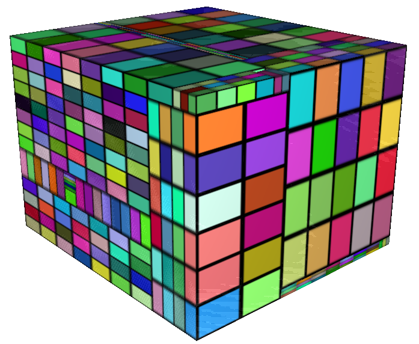
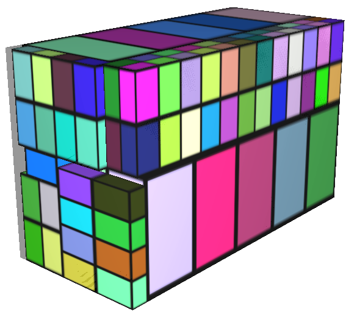
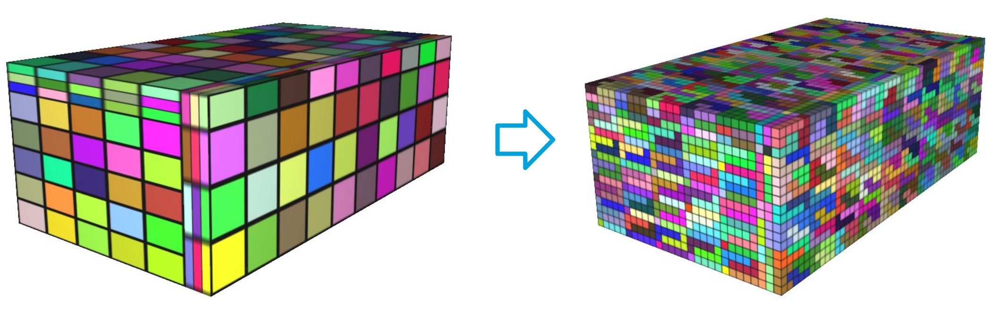
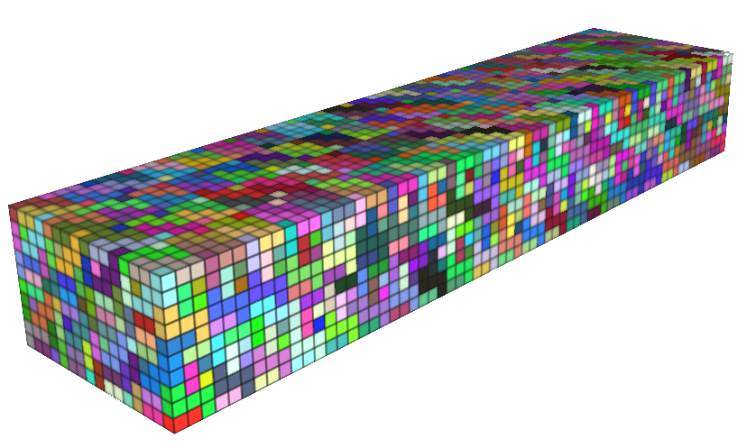
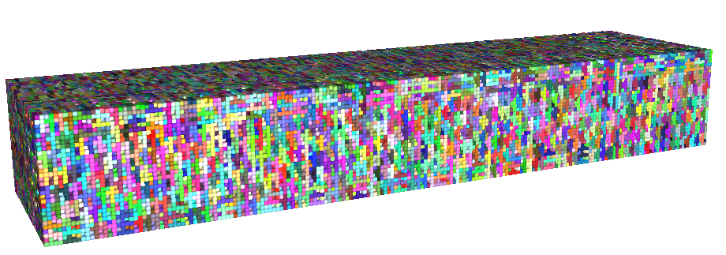

# 3D Packing Problem
For the course Master Research Project 2 at Maastricht University we developed algorithms to fill containers with different parcel or pentominoes. We also implemented a visualizer and a tournament suite. The tournament suite will be used for a course where Bachelor students will design algorithms to solve these problems.

## Parcel Problem
In the parcel problem, we fill a container given a set of parcels with corresponding values. We try to pack the container to maximize the sum of the values of the packed parcels. We implemented a variant of the CLTRS algorithm to do this. Some examples:

## Pentomino Problem
Pentominoes are like Tetris pieces but consisting out of 5 blocks. We implemented a combination of a Dancing Links Algorithm (Algorithm X) and the CLTRS algorithm. We use the DLX to fill smaller parcels with pentominoes. These filled parcels are then passed to the CLTRS algorithm to fill the whole container.

